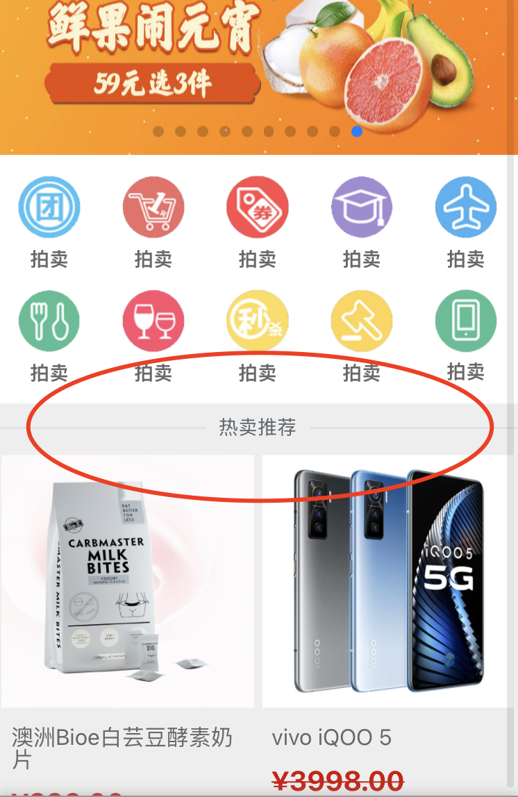

[TOC]

##### 正方形技巧

```
<style>
    * {
        padding: 0;
        margin: 0;
    }

    .box {
        width: 200px;
        height: 400px;
        background-color: #333;
        position: relative;
    }

    .wrapper {
        width: 100%;
        padding-top: 100%;
        background-color: #999;
        position: relative;
    }

    .wrapper>p {
        width: 100%;
        height: 100%;
        position: absolute;
        top: 0;
        left: 0;
        color: #fff;
        background-color: #221133;
        display: flex;
        justify-content: center;
        align-items: center;
    }
</style>

<body>
    <div class="box">
        <div class="wrapper">

            <p>正方形技巧</p>
        </div>
    </div>
</body>
```

##### -热卖推荐-



```
&-title {
    position: relative;
    width: 100%;
    padding: 10px 0;
    font-size: $font-size-l;
    text-align: center;
    &:before,
    &:after {
      content: "";
      position: absolute;
      top: 50%;
      width: 40%;
      height: 1px;
      background-color: #ddd;
    }
    &:before {
      left: 0;
    }
    &:after {
      right: 0;
    }
  }
```
