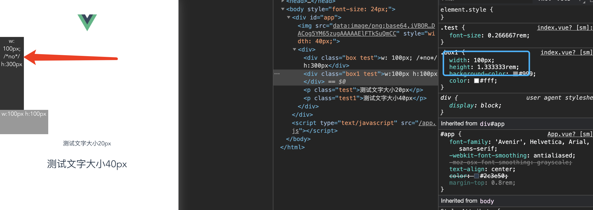

[TOC]

#### 安装所需工具

##### 安装 flexible

```
npm i lib-flexible --save
```

在 main.js 中引入 flexible

```
import 'lib-flexible/flexible'
```

注：可以手动导入flexible源码然后压缩之后引入

#### index.html 增加

```
<meta name="viewport" content="width=device-width, initial-scale=1.0">
```

##### 安装 px2rem

```
npm install px2rem-loader
```

在 build/utils.js 文件中配置 px2rem-loader

```
// 新增开始
const px2remLoader = {
    loader: 'px2rem-loader',
    options: {
      remUnit: 75
    }
  }
// 新增结束 下面还要修改

  // generate loader string to be used with extract text plugin
  function generateLoaders(loader, loaderOptions) {
    // 修改开始
    const loaders = options.usePostCSS ? [cssLoader, postcssLoader, px2remLoader] : [cssLoader, px2remLoader]
  // 修改结束

    if (loader) {
      loaders.push({
        loader: loader + '-loader',
        options: Object.assign({}, loaderOptions, {
          sourceMap: options.sourceMap
        })
      })
    }

    // Extract CSS when that option is specified
    // (which is the case during production build)
    if (options.extract) {
      return ExtractTextPlugin.extract({
        use: loaders,
        fallback: 'vue-style-loader'
      })
    } else {
      return ['vue-style-loader'].concat(loaders)
    }
  }
```

#### 切记：重启 
`npm run dev`


#### 编写代码
```
<template>
  <div>
    <div class="box test">w: 100px; /*no*/ h:300px</div>
    <div class="box1 test">w:100px h:100px</div>
    <p class="test">测试文字大小20px</p>
    <p class="test1">测试文字大小40px</p>
  </div>
</template>

<style>
  .box {
    width: 100px;
    height: 300px;
    background-color: #333;
    color: #fff;
  }

  .box1 {
    width: 100px;
    /*no*/
    height: 100px;
    background-color: #999;
    color: #fff;
  }

  .test {
    font-size: 20px;
  }

  .test1 {
    font-size: 40px;
  }
</style>
```

#### 结果



##### flexible 源码

```
(function flexible (window, document) {
  var docEl = document.documentElement
  var dpr = window.devicePixelRatio || 1

  // adjust body font size
  function setBodyFontSize () {
    if (document.body) {
      document.body.style.fontSize = (12 * dpr) + 'px'
    }
    else {
      document.addEventListener('DOMContentLoaded', setBodyFontSize)
    }
  }
  setBodyFontSize();

  // set 1rem = viewWidth / 10
  function setRemUnit () {
    var rem = docEl.clientWidth / 10
    docEl.style.fontSize = rem + 'px'
  }

  setRemUnit()

  // reset rem unit on page resize
  window.addEventListener('resize', setRemUnit)
  window.addEventListener('pageshow', function (e) {
    if (e.persisted) {
      setRemUnit()
    }
  })

  // detect 0.5px supports
  if (dpr >= 2) {
    var fakeBody = document.createElement('body')
    var testElement = document.createElement('div')
    testElement.style.border = '.5px solid transparent'
    fakeBody.appendChild(testElement)
    docEl.appendChild(fakeBody)
    if (testElement.offsetHeight === 1) {
      docEl.classList.add('hairlines')
    }
    docEl.removeChild(fakeBody)
  }
}(window, document))

```

#### 最后

开发时候直接写px，编译之后转成rem