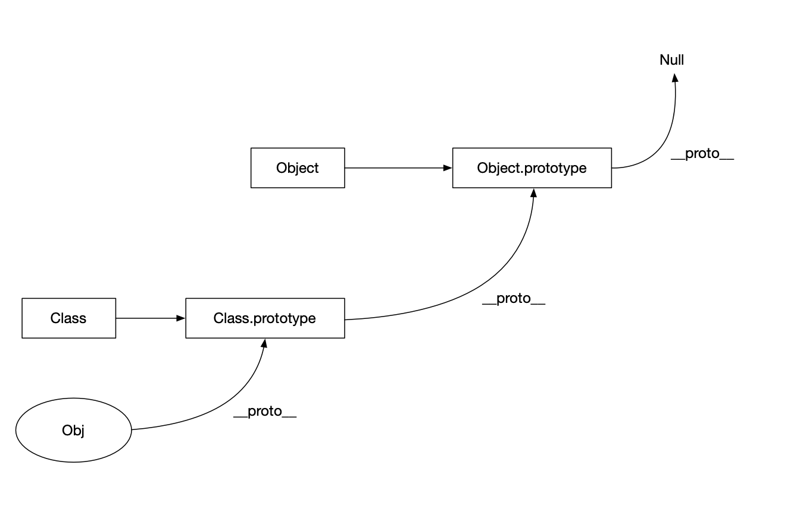

[TOC]

##### 构造函数

##### 构造函数-扩展

```
var a = {}
相当于
var a = new Object()
```

```
var a = []
相当于
var a = new Array()
```

##### call 和 apply 的区别

```
function Add(a, b) {
	return a + b;
}

var datas = [1, 2];

console.log(Add.call(window, 1, 2));
console.log(Add.apply(window, datas));

```

###### 注意 this 指向的是谁

```
var Add = {
    a: 2,
    add: function (b, c) {
        console.log(this);

        return b + c;
    }
}

Add.add(2, 3) // this === Add
Add.add.call({ c: 3 }, 1, 2) // this === {c:3}

var add = Add.add;
add(3, 4); // this === window

var add1 = Add.add.bind({ d: 4 });
add(3, 4) // this === {d : 4}

```

##### 函数默认参数：arguments

```
function add() {
	return arguments[0] + arguments[1];
}
```

function Foo() {

}

var f = new Foo();


